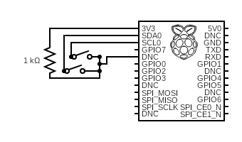
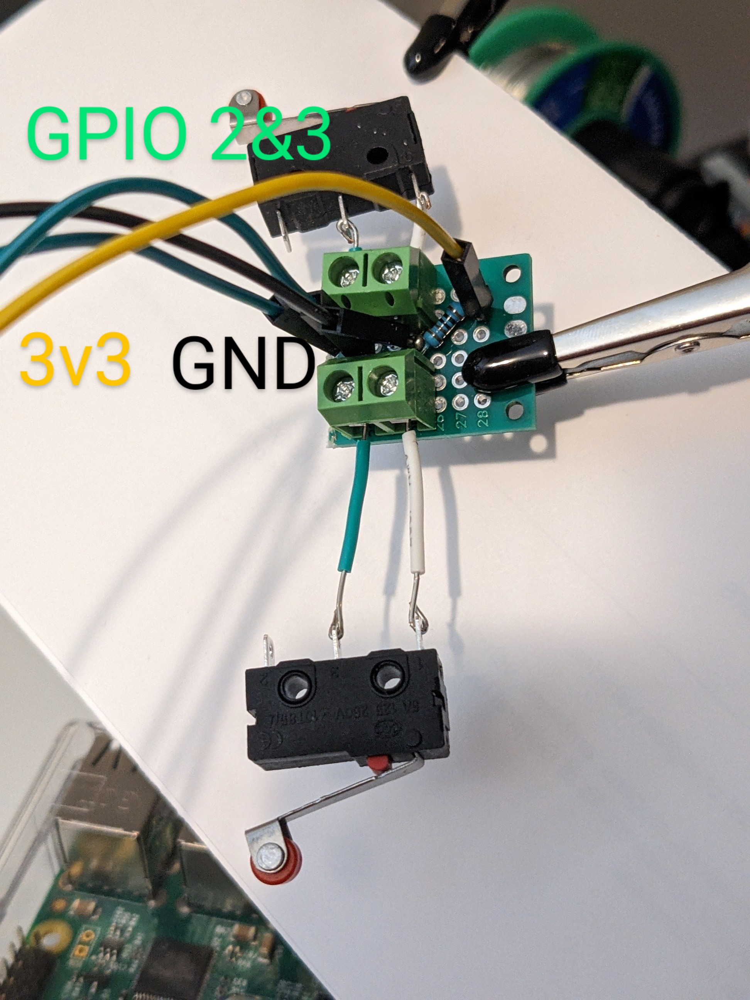

## A fun simple scoreboard project
This is just a little Flask app that utilizes 2 limit switches and some GPIO pins to create a scoreboard for a foosball table that tracks long term scores in a sqlite db.

Partially I just wanted a short project to get a quick sense of accomplishment, and the rest was just to see how fast I could learn basic circuits and Flask.

### Materials used
- Soldering Supplies
- (1) 2X8 cm Double Sided PCB Board
- (4) Dupont male to female wires(2 green, 1 yellow, 1 black)
- (2) 2 Pin 5mm/0.2inch Pitch PCB Mount Screw Terminal Block Connectors
- (2) Lever Limit Switch(I used [these](https://www.amazon.com/dp/B07486RHH7?psc=1&ref=ppx_yo2ov_dt_b_product_details))
- (1) 1K Resistor

### Circuit Design
If any of you people that have taken more than (1) single class of introductory circuits then I'm sure this will be entertaining for you cause that's all I've got in terms of experience.

So here goes:

Beautiful right? I write code for a living not solder.

Anyway here's the result:

Before you ask, no there will not be images of the butchered solder job on the back of this board.

All there really is to it is the 3v3->resistor and ground connected in a rail to the common terminal of the switches(white wires), 
then the GPIO wires attached directly to the NO(normally open) terminals of the switches.
I chose to user the screw terminals so that when/if the switches die or a wire gets severed or whatever they can be easily replaced.

### Code
Went for the fasted possible UI design because I hate html/css. Most of it was just me telling ChatGPT to build this or that in ~2 sentences.

The Flask app was mostly stolen straight out of [this tutorial](https://flask.palletsprojects.com/en/2.3.x/tutorial/layout/). Rest was smashed together from various plugins I wanted to use(socketio, SQLAlchemy, etc.)

To start the server in dev mode `flask --app foosapp run`